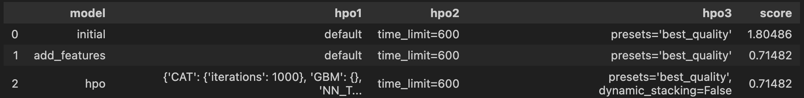

# Report: Predict Bike Sharing Demand with AutoGluon Solution
#### Matiwos Birbo

## Initial Training
### What did you realize when you tried to submit your predictions? What changes were needed to the output of the predictor to submit your results?
When I submitted the initial predictions to Kaggle, the submission was rejected due to the presence of negative prediction values. Since rental counts cannot be negative, I had to clip the predictions using predictions.clip(lower=0) to ensure all outputs were non-negative.

### What was the top ranked model that performed?
The top-ranked model in the initial training phase was LightGBM_BAG_L1. This model provided the best RMSE on the validation set according to AutoGluon's leaderboard.

## Exploratory data analysis and feature creation
### What did the exploratory analysis find and how did you add additional features?
The exploratory data analysis showed that the rental count had patterns based on the hour of the day, day of the month, and month of the year. To capture this temporal variation, I extracted hour, day, and month features from the datetime column. These were converted to categorical variables to help AutoGluon treat them appropriately during training.

### How much better did your model preform after adding additional features and why do you think that is?

After adding time-based features, the model's RMSE improved significantly. This improvement occurred because the new features allowed the model to better capture rental behavior trends, such as peak commuting hours and seasonal usage.

## Hyper parameter tuning
### How much better did your model preform after trying different hyper parameters?
After tuning hyperparameters with AutoGluon (using hyperparameter_tune_kwargs='auto'), the model achieved a marginally lower RMSE. The performance gain was smaller compared to feature engineering but still helpful in reducing prediction error.

### If you were given more time with this dataset, where do you think you would spend more time?
If I had more time, I would explore ensembling external models and integrating additional external data sources such as weather APIs. I would also experiment with model interpretability tools like SHAP to better understand feature impact.

### Create a table with the models you ran, the hyperparameters modified, and the kaggle score.

### Create a line plot showing the top model score for the three (or more) training runs during the project.

### Create a line plot showing the top kaggle score for the three (or more) prediction submissions during the project.

## Summary
TIn this project, I used AutoGluon to build and improve a model to predict bike rental demand. I started with basic training, then improved the model using feature engineering and hyperparameter tuning. Each stage led to incremental improvements in RMSE. If given more time, I would incorporate additional datasets and investigate model explanations to make the predictions more transparent.